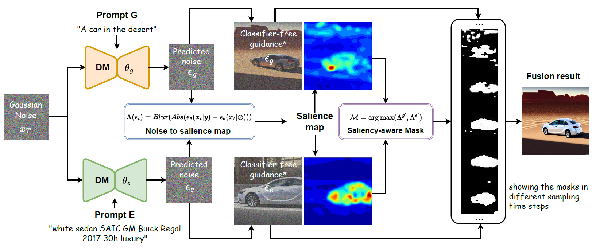

# MagicFusion: Boosting Text-to-Image Generation Performance by Fusing Diffusion Models

### Abstract

> The advent of open-source AI communities has produced a cornucopia of powerful text-guided diffusion models that are trained on various datasets. While few explorations have been conducted on ensembling such models to combine their strengths. In this work, we propose a simple yet effective method called Saliency-aware Noise Blending (SNB) that can empower the fused text-guided diffusion models to achieve more controllable generation. Specifically, we experimentally find that the responses of classifier-free guidance are highly related to the saliency of generated images. Thus we propose to trust different models in their areas of expertise by blending the predicted noises of two diffusion models in a saliency-aware manner. SNB is training-free and can be completed within a DDIM sampling process. Additionally, it can automatically align the semantics of two noise spaces without requiring additional annotations such as masks. Extensive experiments show  the impressive effectiveness of SNB in various applications. Project page is available at https://magicfusion.github.io.

### An overview of our Saiency-aware Noise Blending.



### Preparation

#### Environment

First set-up the `ldm` enviroment following the instruction
from [textual inversion](https://github.com/rinongal/textual_inversion)  repo, or the
original [Stable Diffusion](https://github.com/CompVis/stable-diffusion) repo.

#### Models

To use our method, you need to obtain the pre-trained stable diffusion models following their instructions. You can
decide which version of checkpoint to use, but I use `sd-v1-4-full-ema.ckpt`. You can grab the stable diffusion
model `sd-v1-4-full-ema.ckpt` from https://huggingface.co/CompVis/stable-diffusion-v-1-4-original and make sure to put
it in the root path. Similarly, for the Gartoon model `anything-v3-full.safetensors`, just head over
to https://huggingface.co/Linaqruf/anything-v3.0/tree/main and download the file 'anything-v3-full.safetensors' to the
root path.

### Try MagicFusion

Our method can be quickly utilized through the `magicfusion.sh` file. In this file, you can specify the paths to two
pre-trained models and their corresponding prompts. The program will then generate individual results for each model as
well as the fused output, which will be saved in the designated `outdir` path.

Magicfusion provides strong controllability over the fusion effects of two pre-trained models. To obtain content that
meets our generation requirements, we can first observe the generation results of the two pre-trained models. For
example, in Cross-domain Fusion, the generated results for the prompt "A lion with a crown on his head" with the two
pre-trained models are as follows:

**Genearal Model：**


**Cartoon Model：**


It's pretty obvious that the cartoon model goes a bit too far in anthropomorphizing the lion, whereas the composition
generated by the general model is more aligned with our creative requirements. However, the general model fails to
generate crown.

We can achieve a composition for the generated output that matches the output of the general model while still
maintaining a cartoon style, by simply fusing two models.


Furthermore, we enhance the realism of the generated images by utilizing more of the noise generated by the general
model during the sampling process. Specifically, the fusion is performed at 1000-600 steps, and after 600 steps only the
noise generated by the general model is used.


In this case, we set `magicfusion.sh` as follows,

```
model0="sd-v1-4-full-ema.ckpt"
model1="anything-v3-full.safetensors"  
prompt="A lion with a crown on his head" 
prompt1="A lion with a crown on his head" 

outdir="output/lion_crown"
fusion_selection="600,1,1"
merge_mode=2
```

Feel free to explore the fusion effects of other pre-trained models by replacing `model0` and `model1` and utilizing
the `fusion_selection` tool. Specifically, in the `fusion_selection="v1,v2,v3"` command, the first parameter `v1`
specifies the time point at which our Saliency-aware Noise Blending (SNB) is introduced (or be stoped) during the
sampling process, with one model serving as the default noise generator before this point. The remaining
parameters, `v2`
and `v3`, correspond to the `kg` and `ke` terms in equation 4 of the paper, respectively, and play a crucial role in
determining the fusion details for each time step.

For prompts like 'a bee is making honey', the cartoon model provides a more accurate composition. Therefore, we utilize
more noise generated by the cartoon model during the sampling process. For instance, in the first 1000-850 steps of
sampling, we exclusively use the cartoon model's noise to establish the basic composition of the generated image. We
then switch to our Saliency-aware Noise Blending for the remaining 850 steps to enhance the realism of the scene.

In this case, we set `magicfusion.sh` as follows,

```
model0="sd-v1-4-full-ema.ckpt"
model1="anything-v3-full.safetensors"  
prompt="A bee is making honey" 
prompt1="A bee is making honey" 

outdir="output/making_honey"
fusion_selection="850,1,1"
merge_mode=1
```


For Application 1, i.e., fine-grained fusion, you just need to change expert model to a fine-grained car model, then
give a scene prompt to general model and a fine-grained prompt to car model.

For Application 2, i.e., recontextualization, you need to fine-tune the stable diffusion model for a specific object
like [Dreambooth](https://github.com/XavierXiao/Dreambooth-Stable-Diffusion) does. To generate the specific object with
the placeholder `[]` (e.g. sks), both `model0` and `model1` are specified as the fine-tuned model. Then, the fusion
result can be abtained by giving the prompt '`a photo of [] <class>`' and '`a photo of [] <class> <environment>`'.

For Application 1 and 2, we get the experimental result just by setting `merge_mode=1`.

The program is run with the following command.

```
python scripts/stable_txt2img.py --model0 $model0 --model1 $model1 --outdir $outdir --prompt "$prompt" --prompt1 "$prompt1"  --fusion_selection $fusion_selection --mode $merge_mode
```

Overall, the Salience Map of noise is an important and interesting finding, and MagicFusion can achieve high
controllability of the generated content by simply setting the fusion strategy in the sampling process (e.g., when to
start or stop fusion). More principles and laws about the noise space of diffusion models are expected to be discovered
by exploring our MagicFusion.

Thanks.

<!-- ### BibTeX

```
@misc{zhao2023magicfusion,
      title={MagicFusion: Boosting Text-to-Image Generation Performance by Fusing Diffusion Models}, 
      author={Jing Zhao and Heliang Zheng and Chaoyue Wang and Long Lan and Wenjing Yang},
      year={2023},
      eprint={2303.13126},
      archivePrefix={arXiv},
      primaryClass={cs.CV}
``` -->

